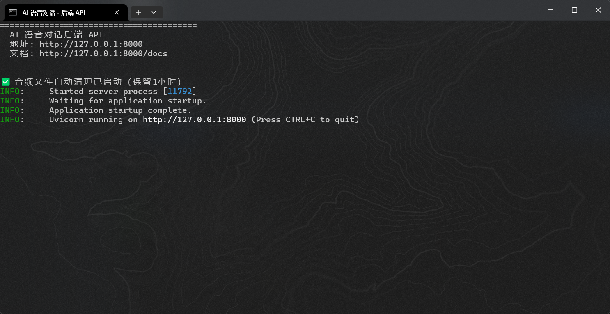

## 对接GPT-SoVite TTS服务

### 启动命令：

配置好环境变量，安装依赖后：

```
启动LLM对话服务.bat
```

### 服务启动成功截图：



### 源码结构：

```
voice-chat-project/                 # 你的项目根目录
│
├── main.py                         # 对话服务
├── requirements.txt                # 所有依赖包清单
├── .env                            # 存放 API 密钥等敏感信息
├── README.md                       # 项目说明
│
├── config/                         # 配置模块
│   ├── __init__.py
│   └── settings.py                 # 所有配置项（API密钥、路径、模型参数等）
│
├── core/                           # 核心业务逻辑
│   ├── __init__.py
│   ├── llm_client.py               # AI 大模型调用（获取回复文字）
│   ├── tts_client.py               # GPT-SoVITS 语音合成调用
│   └── audio_player.py             # 音频播放器
│
├── output/                         # 生成的语音文件存放处
│   └── (GPT-SoVITS 生成的 .wav 文件)
│
└── utils/                          # 工具函数
    ├── __init__.py
    └── helpers.py                  # 日志、文本清洗等辅助功能
```

### 调用关系

```angular2html
┌─────────────────────────────────────────────────────────────┐
│                    你的 GPT-SoVITS 项目目录                   │
│                                                             │
│  ┌─────────────────────────┐    ┌─────────────────────────┐ │
│  │     api_v2.py           │    │  gpt_sovits_final.py    │ │
│  │     (后端 - FastAPI)     │    │  (前端 - tkinter GUI)   │ │
│  │                         │    │                         │ │
│  │ 提供接口:                │    │ 调接口:                  │ │
│  │  POST /tts              │ ←──│  requests.post()       │ │
│  │  GET /set_gpt_weights   │    │                         │ │
│  │  GET /set_sovits_weights│    │ 只管展示、选文件、播放    │ │
│  │  GET /control           │    │                         │ │
│  └─────────────────────────┘    └─────────────────────────┘ │
│                                                             │
│  启动方式:                   启动方式:                        │
│  启动后端.bat                 python gpt_sovits_final.py     │
└─────────────────────────────────────────────────────────────┘

┌─────────────────────────────────────────────────────────────┐
│               你的新项目 voice-chat-project                   │
│                                                             │
│  ┌──────────────┐   ┌──────────────┐   ┌────────────────┐  │
│  │ llm_client.py│ → │ tts_client.py│ → │ audio_player.py│  │
│  │ 调AI大模型    │   │ 调GPT-SoVITS │   │ 播放生成的WAV   │  │
│  │ 获取回复文字  │   │ 把文字变语音  │   │                │  │
│  └──────────────┘   └──────────────┘   └────────────────┘  │
│                             │                               │
│                    调的是同一个 API                          │
│                    http://127.0.0.1:9880/tts                │
└─────────────────────────────────────────────────────────────┘
```

```angular2html
┌──────────────────┐     HTTP API      ┌──────────────────┐     HTTP API      ┌─────────────┐
│   Vue 前端        │ ───────────────→  │  你的 Python 后端  │ ───────────────→  │ GPT-SoVITS │
│   (用户界面)       │ ←─────────────── │   (FastAPI)       │ ←─────────────── │  (TTS引擎)  │
│                   │                  │                   │                  │             │
│  - 对话框         │                  │  - 接收对话请求     │                  │  - 语音合成  │
│  - 音色设置页      │                  │  - 调 AI 大模型    │                  │             │
│  - 播放音频        │                  │  - 调 TTS         │                  │             │
│                   │                  │  - 返回音频给前端   │                  │             │
└──────────────────┘                  └──────────────────┘                  └─────────────┘
```


### LLM配置：

```angular2html
4. 各平台配置对照表
平台	LLM_BASE_URL	LLM_MODEL
DeepSeek	https://api.deepseek.com	deepseek-chat
OpenAI	https://api.openai.com/v1	gpt-4o / gpt-3.5-turbo
通义千问	https://dashscope.aliyuncs.com/compatible-mode/v1	qwen-plus
智谱 GLM	https://open.bigmodel.cn/api/paas/v4	glm-4
Ollama 本地	http://127.0.0.1:11434/v1	qwen2:7b
```
